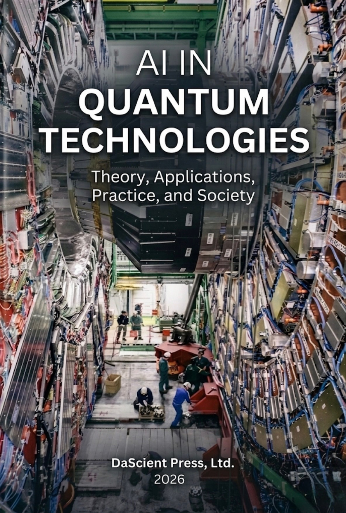

# AI in Quantum Technologies

{ width="100%" }

> *"Do you really believe the moon is only there when you look at it?"* — Albert Einstein

Welcome to the living documentation for **AI in Quantum Technologies: Theory,
Applications, Practice, and Society** (DaScient Press Ltd., 2026). This site is
the companion to the textbook and to the [`aiquantum`](api.md) reference
library, and it weaves together three threads:

- **Conceptual** — the [textbook chapters](chapters/index.md) present the theory
  in full academic prose, organised into eight parts and twenty-four chapters.
- **Computational** — the [`aiquantum`](api.md) Python package implements the
  reference algorithms behind every chapter and powers a production-ready REST
  API.
- **Practical** — the [tutorials](tutorials.md) and [datasets](datasets.md)
  provide hands-on, reproducible learning paths.

## Why AI and quantum, together?

Artificial intelligence and quantum technology are two of the most consequential
scientific currents of the century, and they are increasingly intertwined.
Machine learning compresses the exponential complexity of quantum systems into
tractable models — decoding error syndromes, designing control pulses,
predicting molecular energies, and discovering materials. In the other
direction, quantum hardware promises new substrates for computation that may, in
time, reshape learning itself. This book treats the two fields not as neighbours
but as collaborators.

## How to use this site

1. Start with [Getting Started](getting-started.md) to install the library and
   launch the API.
2. Read the [textbook chapters](chapters/index.md) in order, or dip into a topic
   of interest — each chapter links directly to the code that implements it.
3. Work through a [tutorial](tutorials.md) to see the ideas end-to-end.
4. Consult the [API reference](api.md) when building your own applications.

## Citation

If this work supports your research or teaching, please cite the textbook (see
the [`CITATION.cff`](https://github.com/DaScient/AI-In-Quantum-Technologies/blob/main/CITATION.cff)
file in the repository).
